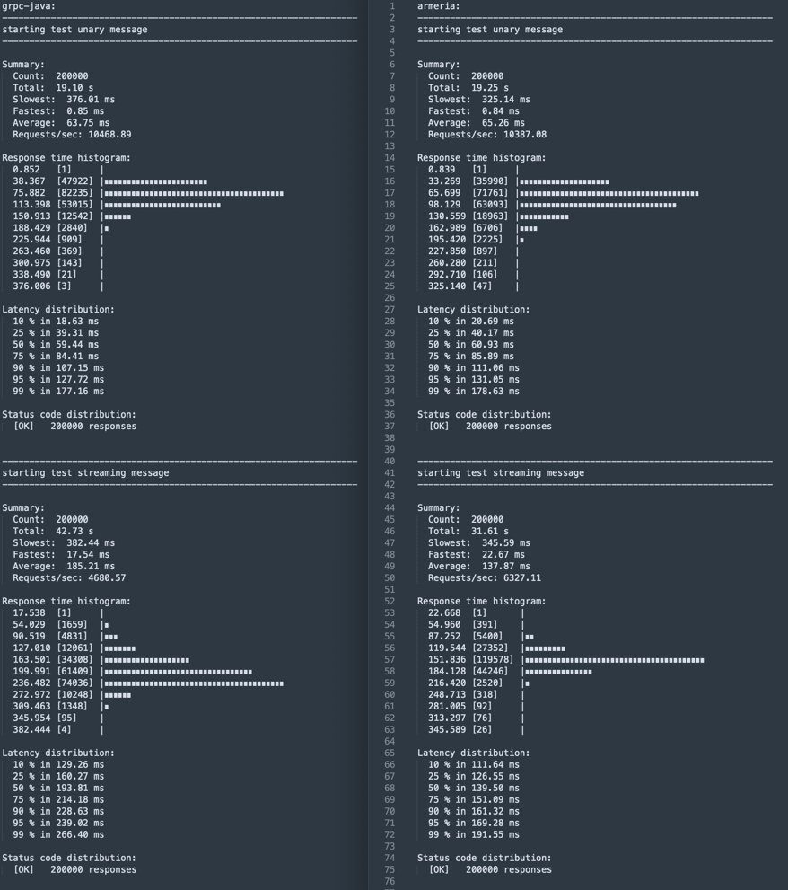

# GRPC Street Test

This project is primarily used for performance testing of both [native gRPC servers](https://github.com/grpc/grpc-java) and [Armeria servers](https://github.com/line/armeria), 
focusing on evaluating the message handling capabilities of Unary and Streaming message types.

## Deployment

During deployment, two machines are used in total: 
1. **Server Node**: acts as the server to handle requests, 
2. **Pressure Node**: Used to send load tests to the server node.

### Protocol

Regardless of the server type, both use the same protocol and identical protocol implementation to ensure valid results.

Here is the [protocol definition](./src/main/proto/hello.proto) with [them implemented in Java](./src/main/java/io/github/liuhan/grpc/test/HelloServiceHandler.java).

### Server Node

Use the following command to ensure that all necessary packages are fully downloaded, 
and to compile and package the server code:

```shell
# Install necessary packages
sudo apt update && sudo apt install -y git zip unzip make

# Install Java 11 by sdkman
curl -s "https://get.sdkman.io" | bash
source "/home/hanliu/.sdkman/bin/sdkman-init.sh"
sdk install java 11.0.17-amzn

# Clone the project and build
git clone https://github.com/mrproliu/grpc-street-test.git
cd grpc-street-test
make build
```

After package, you will find the following two JAR files in the `target` directory:
1. `test-grpc-java.jar`: the native gRPC server with port `8888`.
2. `test-armeria.jar`: the Armeria gRPC server with port `8888`.

To prepare for testing, you can start the corresponding server using `start-grpc-java` or `start-armeria`.
Upon startup, it will also output the local IP address, allowing the pressure node to send requests to this server.

### Pressure Node

The pressure node is relatively simpler. It uses the [ghz library](https://ghz.sh/) to send requests to the gRPC server. 
Please run the following command to download the project and its dependencies:

```shell
# Install necessary packages
sudo apt update && sudo apt install -y git make

# Clone the project
git clone https://github.com/mrproliu/grpc-street-test.git
cd grpc-street-test
```

By executing the following command, the system will send unary and streaming requests to the gRPC server machine and automatically output the test results:

```shell
SERVER_HOST=$(SERVER_HOST) make test-grpc
```

## Test Results


The following chart illustrates the performance comparison between using the native gRPC server(left) and the Armeria server(right).

